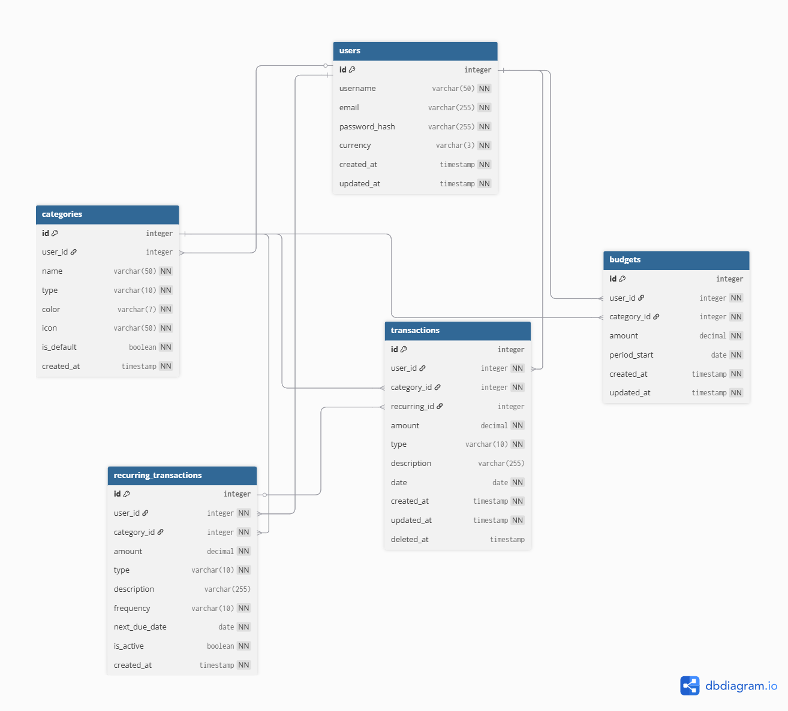

# ClearLedger

A personal finance tracker built as a Database course final project. Track income and expenses, set monthly budgets, and visualize spending patterns — all backed by a PostgreSQL database with complex analytical queries.

## Live Demo

> 🔗 App: https://clearledger-eta.vercel.app
> 🎥 Demo video: _coming soon_

Test accounts:
- `user1@clearledger.dev` / `password123`
- `user2@clearledger.dev` / `password123`
- `user3@clearledger.dev` / `password123`

---

## What It Does

ClearLedger lets users:

- Register and log in securely with JWT authentication
- Add, edit, and delete income and expense transactions
- Organize transactions by category with color coding
- Set monthly budgets per category
- View budget progress in real time on the dashboard
- Get alerted when a budget is exceeded
- Analyze spending trends and category breakdowns with 5 chart types
- Filter and sort transactions by date, type, category, and amount
- Track month-over-month spending changes per category

---

## Tech Stack

| Layer | Technology |
|---|---|
| Frontend | React + Vite, React Router, Recharts, Axios |
| Backend | FastAPI (Python) |
| Database | PostgreSQL (hosted on Supabase) |
| ORM | SQLAlchemy |
| Migrations | Alembic |
| Auth | JWT + bcrypt |
| Deployment | Render (backend), Vercel (frontend) |

---

## Database Schema

The database has 5 tables:

- **users** — registered accounts with hashed passwords
- **categories** — spending/income categories, either system defaults or user-created
- **transactions** — individual income or expense entries with soft delete
- **budgets** — monthly spending limits per category per user
- **recurring_transactions** — templates for automatic recurring entries



Full schema in DBML: [`docs/schema.dbml`](docs/schema.dbml)

---

## Key Database Features

**Indexes** — 4 custom indexes for query performance:
- Composite index on `(user_id, date)` for transaction filtering
- Composite index on `(user_id, period_start)` for budget lookups
- Partial index on active transactions (`WHERE deleted_at IS NULL`)
- Partial index on active recurring templates (`WHERE is_active = TRUE`)

**Soft delete** — transactions are never permanently deleted; `deleted_at` is set instead, preserving historical budget accuracy

**Analytical queries** using PostgreSQL-specific features:
- `DATE_TRUNC` for monthly aggregation
- `CASE WHEN` for conditional aggregation (income vs expense)
- CTEs and `CROSS JOIN` for percentage share calculations
- `HAVING` for over-budget detection
- `RANK()` window function for category spending ranking
- `LAG()` window function for month-over-month comparison

---

## API Endpoints

19 endpoints across 5 routers:

| Method | Endpoint | Description |
|---|---|---|
| POST | `/api/v1/auth/register` | Register + seed default categories |
| POST | `/api/v1/auth/login` | Login, returns JWT |
| GET | `/api/v1/auth/me` | Get current user |
| GET | `/api/v1/categories` | List categories |
| POST | `/api/v1/categories` | Create custom category |
| DELETE | `/api/v1/categories/{id}` | Delete category |
| GET | `/api/v1/transactions` | List transactions (paginated, filterable) |
| POST | `/api/v1/transactions` | Add transaction |
| PATCH | `/api/v1/transactions/{id}` | Update transaction |
| DELETE | `/api/v1/transactions/{id}` | Soft delete transaction |
| GET | `/api/v1/budgets` | List budgets |
| POST | `/api/v1/budgets` | Create budget |
| PATCH | `/api/v1/budgets/{id}` | Update budget |
| GET | `/api/v1/analytics/overview` | Spending vs budget this month |
| GET | `/api/v1/analytics/trends` | Net savings over 6 months |
| GET | `/api/v1/analytics/breakdown` | Top 5 categories by spend share |
| GET | `/api/v1/analytics/breach` | Over-budget categories |
| GET | `/api/v1/analytics/rank` | Categories ranked by spending |
| GET | `/api/v1/analytics/mom` | Month-over-month comparison |

---

## Project Structure

```
clearledger/
├── backend/
│   ├── app/
│   │   ├── models/          # SQLAlchemy models
│   │   ├── schemas/         # Pydantic schemas
│   │   ├── routers/         # API endpoints
│   │   ├── utils/           # Auth, hashing
│   │   ├── database.py      # DB connection
│   │   ├── config.py        # Settings
│   │   └── main.py          # FastAPI app
│   ├── migrations/          # Alembic migrations
│   ├── scripts/
│   │   └── seed.py          # Faker-based data seeder
│   ├── tests/               # 44 pytest tests
│   └── requirements.txt
├── frontend/
│   └── src/
│       ├── api/             # Axios client
│       ├── context/         # Auth + Toast context
│       ├── components/      # Navbar, ProtectedRoute, Toast, ConfirmModal
│       ├── pages/           # Dashboard, Transactions, Budgets, Charts
│       └── utils/           # formatEuro, formatRelativeDate
└── docs/
    ├── schema.png
    └── schema.dbml
```

---

## Running Locally

### Prerequisites
- Python 3.11+
- Node.js 18+
- A PostgreSQL database (or use the Supabase connection)

### Backend

```bash
cd backend
python -m venv venv
venv\Scripts\activate        # Windows
# source venv/bin/activate   # Mac/Linux
pip install -r requirements.txt
```

Create `backend/.env`:
```
DATABASE_URL=postgresql://...
SECRET_KEY=your-secret-key
ALGORITHM=HS256
ACCESS_TOKEN_EXPIRE_MINUTES=60
```

```bash
alembic upgrade head
uvicorn app.main:app --reload
```

API docs available at `http://localhost:8000/docs`

### Frontend

```bash
cd frontend
npm install
npm run dev
```

App available at `http://localhost:5173`

### Seed Database (optional)

```bash
cd backend
python scripts/seed.py
```

Generates ~180 transactions, ~72 budgets, and 6 recurring templates across 3 test users.

---

## Tests

44 tests covering all endpoints:

```bash
cd backend
python -m pytest tests/ -v
```

| Test file | Tests |
|---|---|
| test_auth.py | 9 |
| test_categories.py | 6 |
| test_transactions.py | 14 |
| test_budgets.py | 6 |
| test_analytics.py | 9 |
| **Total** | **44** |

---

## Author

Alireza — SDT student, Constructor University
GitHub: [@Alir3zag](https://github.com/Alir3zag)
